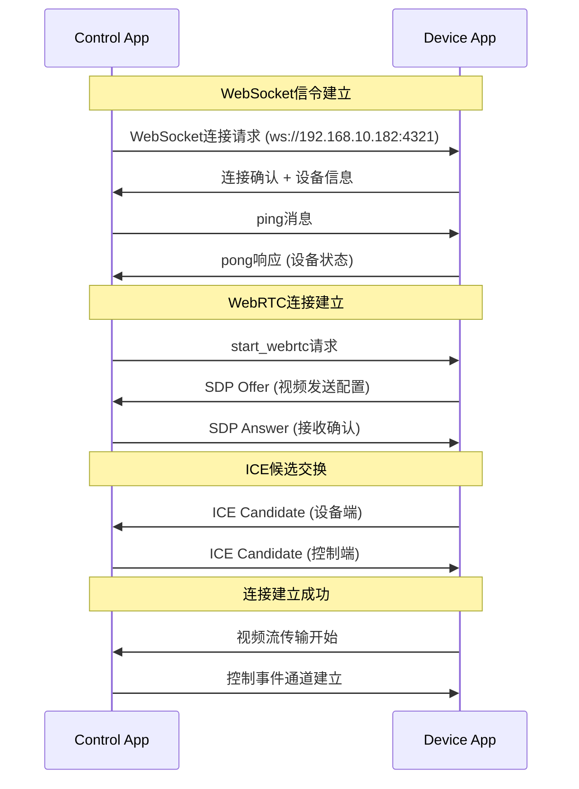
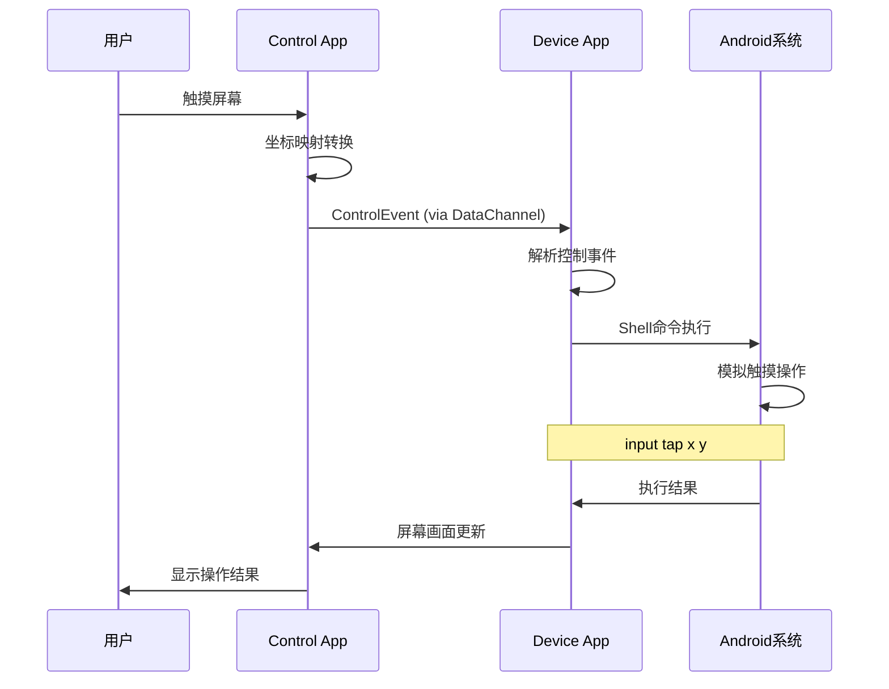
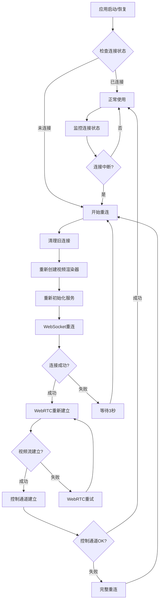

# WebRTC 远程控制系统

## 📱 项目简介

这是一个基于 WebRTC 技术的 Android 设备远程控制系统，能够实现实时屏幕共享和远程触摸控制。系统包含两个核心组件：

- **🎯 Device App (Android)**：被控制的 Android 设备端，负责屏幕共享和接收控制指令
- **📱 Control App (Flutter)**：控制端应用，可在移动设备上运行，用于远程操作 Android 设备

## ✨ 核心功能

### 🖥️ 实时屏幕共享
- 📺 高清屏幕实时传输（最高支持 1824x1080 分辨率）
- ⚡ 低延迟显示（经过优化的 WebRTC 配置）
- 🎨 硬件编解码加速
- 📊 自适应码率调整（默认 500kbps）

### 🎮 远程触摸控制
- 👆 精确触摸定位和坐标映射
- 🖱️ 多种手势支持：点击、长按、滑动
- ⌨️ 系统按键控制：返回键、主页键、菜单键
- 🎯 实时触摸反馈

### 🔄 智能连接管理
- 🌐 局域网设备自动发现
- 🔗 WebSocket 信令交换
- 🔄 自动重连机制
- 📱 应用生命周期管理

### 🛡️ 稳定性保障
- 🏃 前台服务防止意外终止
- 🔧 异常处理和资源清理
- 📊 连接状态实时监控
- 🔒 权限管理和安全控制

## 🏗️ 系统架构

```
┌─────────────────────┐    WebSocket     ┌─────────────────────┐
│   Control App       │◄──── 信令交换 ────►│   Device App        │
│   (Flutter)         │                  │   (Android)         │
│                     │    WebRTC        │                     │
│ ┌─────────────────┐ │◄──── 音视频流 ────►│ ┌─────────────────┐ │
│ │   控制界面      │ │                  │ │   屏幕捕获      │ │
│ │ - 视频显示      │ │   DataChannel    │ │ - MediaProjection│ │
│ │ - 手势识别      │ │◄──── 控制事件 ────►│ │ - ScreenCapturer │ │
│ │ - 坐标映射      │ │                  │ │ - VideoSource   │ │
│ └─────────────────┘ │                  │ └─────────────────┘ │
│                     │                  │                     │
│ ┌─────────────────┐ │                  │ ┌─────────────────┐ │
│ │ WebRTC Service  │ │                  │ │ WebRTC Manager  │ │
│ │ - Peer连接      │ │                  │ │ - Peer连接      │ │
│ │ - 流接收        │ │                  │ │ - 视频发送      │ │
│ │ - 事件发送      │ │                  │ │ - 事件接收      │ │
│ └─────────────────┘ │                  │ └─────────────────┘ │
│                     │                  │                     │
│ ┌─────────────────┐ │                  │ ┌─────────────────┐ │
│ │ WebSocket客户端 │ │                  │ │ WebSocket服务器 │ │
│ │ - 设备发现      │ │                  │ │ - 客户端管理    │ │
│ │ - 信令处理      │ │                  │ │ - 消息路由      │ │
│ │ - 自动重连      │ │                  │ │ - 连接监控      │ │
│ └─────────────────┘ │                  │ └─────────────────┘ │
└─────────────────────┘                  │                     │
                                         │ ┌─────────────────┐ │
                                         │ │ Touch Control   │ │
                                         │ │ - 事件解析      │ │
                                         │ │ - Shell命令     │ │
                                         │ │ - 触摸模拟      │ │
                                         │ └─────────────────┘ │
                                         └─────────────────────┘
```

## 🔧 技术栈

### Device App (Android)
- **📱 平台**：Android 5.0+ (API Level 21+)
- **🔗 WebRTC**：Google WebRTC 原生库
- **🌐 网络通信**：Java-WebSocket
- **📹 屏幕捕获**：MediaProjection API + ScreenCapturerAndroid
- **🎯 触摸控制**：Android Shell Input命令
- **🗂️ 数据序列化**：Gson

### Control App (Flutter)
- **📱 平台**：Flutter 3.0+，支持 Android/iOS
- **🔗 WebRTC**：flutter_webrtc 插件
- **🌐 网络通信**：web_socket_channel
- **🎨 UI框架**：Material Design
- **🗂️ 数据序列化**：json_annotation

### 核心技术
- **📡 音视频传输**：WebRTC P2P连接
- **🔄 信令交换**：WebSocket
- **🎥 视频编码**：VP8/VP9 硬件编码
- **🎯 坐标映射**：实时坐标转换算法
- **🔗 连接管理**：ICE协议 + STUN/TURN

## 📦 安装配置

### 环境要求

#### Device App 环境
```bash
- Android Studio 4.0+
- Android SDK API Level 21+
- Gradle 7.0+
- Java 8+
```

#### Control App 环境
```bash
- Flutter SDK 3.0+
- Dart 2.18+
- Android Studio 或 VS Code
- Android SDK / Xcode (iOS开发)
```

### 🛠️ 编译安装

#### 1. Device App 编译
```bash
cd remote_control_apps/DeviceApp
./gradlew assembleDebug
# 安装到Android设备
adb install app/build/outputs/apk/debug/app-debug.apk
```

#### 2. Control App 编译
```bash
cd remote_control_apps/control_app
flutter pub get
flutter build apk
# 安装到控制设备
flutter install
```

## 🚀 使用指南

### 📱 Device App 使用步骤

#### 1. 启动应用
- 在被控制的Android设备上启动Device App
- 应用将显示当前设备的IP地址和端口信息

#### 2. 授权权限
```
第一次使用需要授权以下权限：(当然，我们自己的系统不需要，因为系统权限)
✅ 屏幕录制权限 (MediaProjection)
✅ 网络访问权限
✅ 前台服务权限
```

#### 3. 开始服务
- 点击"开始屏幕共享"按钮
- 系统将弹出屏幕录制授权对话框（no need）
- 点击"立即开始"授权屏幕录制
- 应用将启动WebSocket服务器 (端口: 4321)
- 状态栏将显示"屏幕共享已启动"

#### 4. 网络配置
- 确保设备连接到局域网WiFi
- 记录显示的IP地址 (例如: 192.168.10.182)
- 确保防火墙未阻止4321端口

### 📱 Control App 使用步骤

#### 1. 启动应用
- 确认自己设备端的ip多少，手动在代码中修改对应的ip
- 在控制设备上启动Control App
- 应用将显示设备发现界面

#### 2. 连接设备
- 应用会自动扫描局域网内的设备
- 或者手动输入Device App显示的IP地址
- 点击设备列表中的目标设备

#### 3. 建立连接
```
连接过程：
🔄 WebSocket连接建立
🔄 WebRTC信令交换
🔄 视频流传输建立
🔄 控制通道建立
✅ 连接成功，开始远程控制
```

#### 4. 远程控制
- **👆 单击**：轻触屏幕任意位置
- **👆 长按**：长按屏幕触发长按事件
- **👆 滑动**：按住并滑动进行拖拽操作
- **⌨️ 系统按键**：使用右侧控制面板的按钮

### 🎮 控制操作说明

#### 触摸手势
| 手势 | 操作 | 说明 |
|------|------|------|
| 👆 轻触 | 单击 | 在目标位置执行点击操作 |
| 👆 长按 | 长按 | 触发长按菜单或特殊功能 |
| 👆 滑动 | 拖拽/滑动 | 支持各种方向的滑动操作 |

#### 系统按键
| 按键 | 功能 | 对应Android按键 |
|------|------|----------------|
| 🔙 返回 | Back键 | KEYCODE_BACK |
| 🏠 主页 | Home键 | KEYCODE_HOME |
| ☰ 菜单 | Menu键 | KEYCODE_MENU |

#### 坐标映射
```
控制端屏幕坐标 → 设备端屏幕坐标
映射算法：
deviceX = (touchX / controlWidth) × 1824
deviceY = (touchY / controlHeight) × 1080
```

## 📊 连接流程详解

### 🔗 WebSocket信令流程


### 🎯 控制事件流程


### 🔄 重连机制流程


## ⚙️ 配置说明

### Device App 配置

#### 性能参数配置 (WebRTCManager.java)
```java
// 视频质量配置
private final static int FRAME_RATE = 30;          // 帧率
private final static int MAX_BITRATE = 500000;     // 码率 (bps)

// RTP编码参数
encoding.maxBitrateBps = MAX_BITRATE;               // 最大码率
encoding.maxFramerate = FRAME_RATE;                // 最大帧率
encoding.scaleResolutionDownBy = 2.0;              // 分辨率缩放
```

#### 网络配置 (WebSocketService.java)
```java
private static final int PORT = 4321;              // WebSocket端口
// 绑定地址："0.0.0.0" (所有网络接口)
```

#### 屏幕捕获配置 (ScreenCaptureService.java)
```java
private static final int FRAME_RATE = 30;          // 捕获帧率
// 分辨率：自动检测设备屏幕分辨率
```

### Control App 配置

#### WebRTC客户端配置 (webrtc_service.dart)
```dart
// ICE服务器配置
final configuration = {
  'iceServers': [
    {'urls': 'stun:stun.l.google.com:19302'},      // STUN服务器 需要删除（设备端已经删除）
  ],
};

// 数据通道配置
RTCDataChannelInit()..ordered = true;              // 有序传输
```

#### 设备发现配置 (device_discovery_service.dart)
```dart
final String defaultDeviceIP = '192.168.10.182';   // 默认设备IP
final int defaultPort = 4321;                      // 默认端口
```

#### 触摸映射配置 (control_screen.dart)
```dart
final double deviceWidth = 1824;                   // 目标设备宽度
final double deviceHeight = 1080;                  // 目标设备高度
final double minSwipeDistance = 20;                // 最小滑动距离
```

## 🐛 故障排除

### 常见问题及解决方案

#### 🔴 连接失败
**问题**：Control App无法连接到Device App
**排查步骤**：
1. ✅ 确认两设备在同一WiFi网络
2. ✅ 检查Device App的IP地址显示
3. ✅ 确认Device App的WebSocket服务已启动
4. ✅ 检查网络防火墙设置
5. ✅ 尝试手动输入IP地址连接

**解决方法**：
```bash
# 1. 检查网络连通性
ping 192.168.10.182

# 2. 检查端口开放
telnet 192.168.10.182 4321

# 3. 重启Device App服务
# 在Device App中重新点击"开始屏幕共享"
```

#### 🔴 黑屏问题
**问题**：连接成功但显示黑屏
**可能原因**：
1. 屏幕录制权限未授权
2. MediaProjection服务未正常启动
3. WebRTC视频流传输中断

**解决方法**：
```bash
# 1. 重新授权屏幕录制权限
# 在Device App中重新启动屏幕共享

# 2. 检查应用日志
adb logcat | grep "ScreenCaptureService\|WebRTCManager"

# 3. 重启应用
# 完全关闭Device App并重新启动
```

#### 🔴 触摸不响应
**问题**：能看到画面但无法控制
**排查步骤**：
1. ✅ 确认DataChannel连接状态
2. ✅ 检查触摸权限设置
3. ✅ 验证坐标映射是否正确

**解决方法**：
```bash
# 1. 检查触摸事件日志
adb logcat | grep "TouchControlService\|ControlEvent"

# 2. 手动测试触摸命令
adb shell input tap 500 500

# 3. 检查控制端日志
# 查看Control App的调试输出
```

#### 🔴 延迟过高
**问题**：操作响应延迟明显
**优化方法**：
1. 调整视频质量参数
2. 检查网络质量
3. 优化设备性能

```java
// 降低码率减少延迟
private final static int MAX_BITRATE = 300000;     // 改为300kbps

// 降低帧率
private final static int FRAME_RATE = 24;          // 改为24fps

// 调整分辨率缩放
encoding.scaleResolutionDownBy = 3.0;              // 提高缩放比例
```

#### 🔴 应用崩溃
**问题**：应用意外退出
**调试方法**：
```bash
# 1. 查看崩溃日志
adb logcat | grep "AndroidRuntime\|FATAL"

# 2. 检查内存使用
adb shell dumpsys meminfo com.example.deviceapp

# 3. 检查权限状态
adb shell dumpsys package com.example.deviceapp | grep permission
```

### 📊 性能监控

#### 监控指标
```bash
# 1. CPU使用率
adb shell top | grep deviceapp

# 2. 内存使用
adb shell dumpsys meminfo com.example.deviceapp

# 3. 网络流量
adb shell cat /proc/net/dev

# 4. 帧率统计
# 在WebRTC日志中查看 "EglRenderer: Duration"
```

#### 性能优化建议
1. **📱 设备性能**：建议使用中高端Android设备
2. **🌐 网络环境**：使用5GHz WiFi，确保良好信号强度
3. **⚡ 电源管理**：关闭省电模式，保持设备充电
4. **🚫 后台限制**：添加应用到白名单，防止后台杀死

## 📝 开发说明

### 项目结构
```
WebRTC_demo/
├── remote_control_apps/
│   ├── DeviceApp/                 # Android被控设备端
│   │   ├── app/src/main/java/com/example/deviceapp/
│   │   │   ├── MainActivity.java           # 主界面
│   │   │   ├── ScreenCaptureService.java   # 屏幕捕获服务
│   │   │   ├── WebSocketService.java       # WebSocket服务器
│   │   │   ├── WebRTCManager.java          # WebRTC管理
│   │   │   ├── TouchControlService.java    # 触摸控制
│   │   │   └── ControlEvent.java           # 控制事件模型
│   │   └── app/src/main/res/               # Android资源文件
│   │
│   └── control_app/              # Flutter控制端
│       ├── lib/
│       │   ├── main.dart                   # 应用入口
│       │   ├── screens/
│       │   │   ├── device_list_screen.dart # 设备列表界面
│       │   │   └── control_screen.dart     # 控制界面
│       │   ├── services/
│       │   │   ├── device_discovery_service.dart  # 设备发现
│       │   │   ├── websocket_service.dart          # WebSocket客户端
│       │   │   └── webrtc_service.dart             # WebRTC客户端
│       │   └── models/
│       │       ├── device.dart             # 设备模型
│       │       └── control_event.dart      # 控制事件模型
│       └── pubspec.yaml                    # Flutter依赖配置
│
└── README.md                     # 项目文档 (本文件)
```

### 贡献指南

#### 开发环境搭建
1. **克隆代码库**
2. **配置Android开发环境**
3. **配置Flutter开发环境**
4. **运行测试确保环境正常**

#### 代码规范
- **Java**: 遵循Google Java Style Guide
- **Dart**: 遵循Dart官方代码规范
- **提交**: 使用Conventional Commits规范

#### 功能扩展建议
1. **🔍 设备发现**: 实现mDNS/Bonjour自动发现
2. **🔒 安全认证**: 添加设备配对和加密传输
3. **🎵 音频支持**: 支持音频流传输
4. **📁 文件传输**: 实现文件拖拽传输
5. **🎮 多点触控**: 支持更复杂的手势操作
6. **📊 性能监控**: 添加实时性能指标显示

## 📄 许可证

本项目遵循 MIT 许可证，详见 [LICENSE](LICENSE) 文件。

## 👥 作者信息

- **开发者**: Me & Claude Code Assistant
- **项目类型**: WebRTC远程控制演示项目
- **技术支持**: 基于WebRTC、WebSocket、Flutter技术栈

## 🙏 致谢

感谢以下开源项目的支持：
- [WebRTC](https://webrtc.org/) - 实时通信技术
- [Flutter](https://flutter.dev/) - 跨平台UI框架
- [Java-WebSocket](https://github.com/TooTallNate/Java-WebSocket) - WebSocket服务器实现
- [flutter_webrtc](https://pub.dev/packages/flutter_webrtc) - Flutter WebRTC插件

---

📞 **技术支持**: 如有问题，请查看故障排除章节或提交Issue  
🔄 **版本**: v1.0.0  
📅 **更新时间**: 2025-06-19